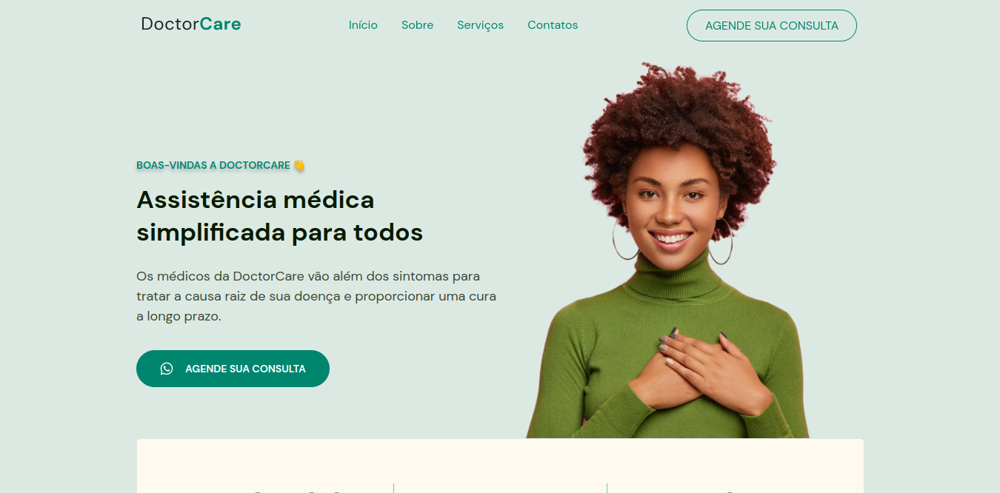
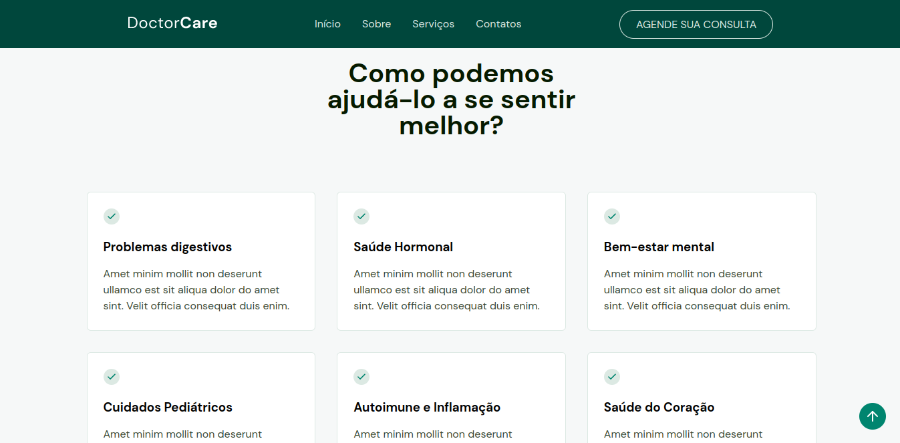
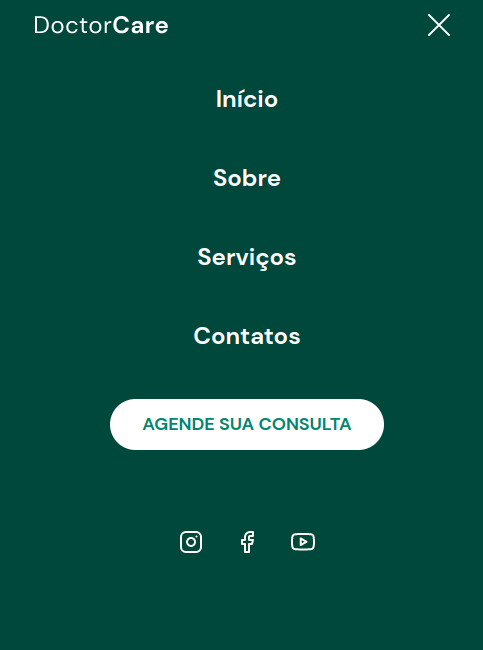

# DoctorCare

Olá pessoal, esse é um projeto desenvolvido em uma semana, com o NLW Return. Consiste em uma pagina de uma medica chamada __care__, contando um pouco sobre os serviços prestados por ela.

## DesckTop Mode
O projeto engloba dois modos de visão do site, um para celulares e dois, para aparelhos maiores.

### Uma das áreas do site
O site contém várias partes de informações sobre a doctor care .

## Smartphone Mode

### Menu do smartphone 
O modo para celulares também apresentada neste projeto, conta com muito experiências de usuários.

## Tecnologias usadas
- HTML5
-  CSS3
- JS

## Autor 
_Hugo Rodrigues Pereira_